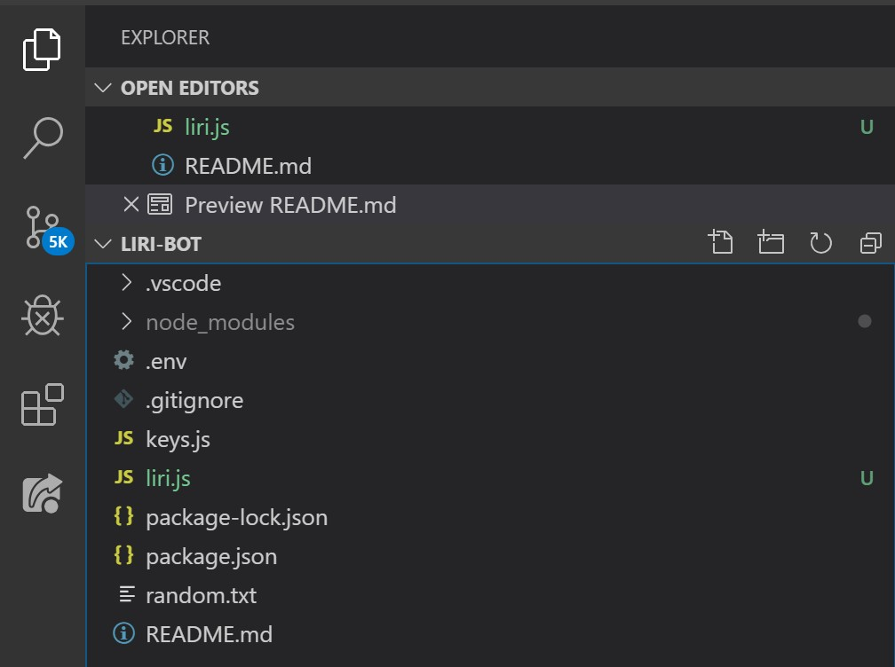
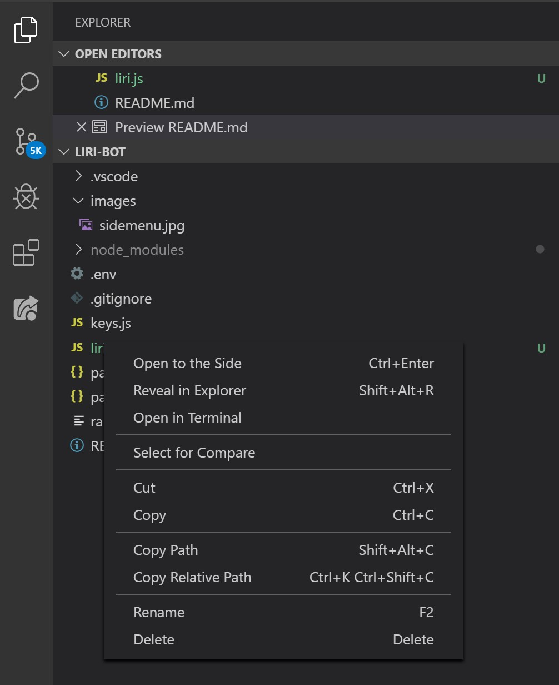

# Liri 

*by: Matthew Carpenter*

## About 

Liri is a Node.js project that uses a combination of Node Package Manager (npm) and Aplicstion Interface JavaScript Object Notation documents (API, JSON).
Using terminal you can perform a series of commands that will return media information. (See requirements for more details).

## Index 

[Requirements ](#Requirements) 

[How it works](#How-it-works) 

[Edge Cases](#Edge-Cases) 

[How to install](#How-to-install) 

[npm](#npm) 

## Requirements 

This project requires the following applications to launch.


* Node.js
* Text Editor
    * Notepad++
    * VS Code
    * Brackets
* Understanding of nps.
* Love for Music

---

## How it works

 1. After installing the project. *download instructions [here](#How-to-install).*  
      
     Launch into your favorite text editor with terminal or shell command access. Or launch project in Node.js by typing the following.  
```
node liri.js
```

 2. Then press return.

 3. You should be prompted with the following options:

```
 Hey Liri, when's the next time my favorite band plays live?

 Hey Liri, Show me information about this movie. 

 Hey Liri, Can you Spotify a song for me?

 Hey Liri, do something with an external document. 
```
 

After selecting what you would like Liri to do then you will be prompted to enter additional details about your query.

## Edge Cases

Some edge cases have been handled.
* double spacing 
* blank entries
* key security 
* some error handling 
* moment and time zone moments npm package.
There are remaining edge cases. For more details on current issues go to the [issues](https://github.com/getHashSet/Liri-Bot/issues) section for more details.

## How to install

How to install this project and the steps you’ll need to take to download the npm requirements are as follows. example using VS Code and GitHub

 1. Download Node.js [here](https://nodejs.org/en/download/).

 2. Download Visual Studio Code [here](https://code.visualstudio.com/download).  
     

 3. Visit GitHub [here](https://github.com/getHashSet/Liri-Bot) to install the latest version of the project.  
      
     You may do so using the clipboard icon located in the top right corner of the GitHub project window.  
     

 4. Windows Only 
      
     Download Gitbash [here](https://gitforwindows.org/).

 5. Launch GitBash (for Windows) or terminal (for Mac) and navigate to the folder you would like to place the cloned directory folder. Common git commands and universal shell commands can be found [here](https://git-scm.com/doc).

 If you are not a listed collaborator then you will need to **fork** the project to your own GitHub repository. Once you have the url coppied to your clipboard then move to step 6.

 6. Type the following `git clone`.

 7. Follow by `code .`

 8. On the left side of the screen you should see the file path. 

  

 9. Option click that path and launch terminal. 

 

 10. Now you are ready to perform the node commands found in the [How it works](#how-it-works) section!

## npm

Before launching the project perform the following commands and update the keys to access the corresponding information for omdb and Spotify. (See [API key section](#api-keys)).

```javascript

let spotify = new Spotify(keys.spotify);
let omdbkey = "your key goes here";

```

**keys.spotify** is located in keys.js file.

```javascript
exports.spotify = {
  id: process.env.SPOTIFY_ID,
  secret: process.env.SPOTIFY_SECRET
};
```

those files are refrence from the .env file that is not included in the GitHub project.


[Back to top](#)